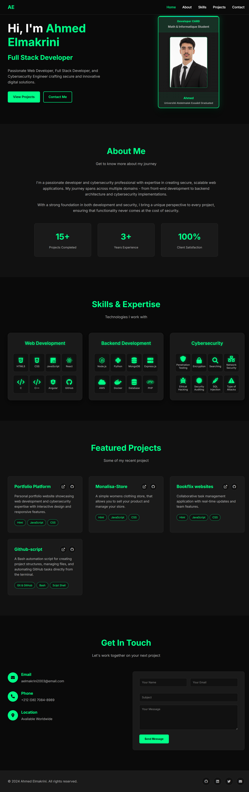

# 💼 Personal Portfolio Website

A modern and responsive personal portfolio website built using HTML, CSS, and JavaScript.

---

# 🚀 Features

- Responsive design
- Smooth scrolling
- Modern UI/UX
- Interactive animations
- Projects showcase section
- About section
- Contact section
- Social media links

---

# 🛠️ Technologies Used

- HTML5
- CSS3
- JavaScript

---

# 📁 Project Structure

```bash
portfolio/
│
├── index.html
├── css/
│   └── style.css
├── js/
│   └── script.js
├── images/
└── README.md
```

---

# ⚡ Installation

Clone the repository:

```bash
git clone YOUR_REPOSITORY_URL
```

Open the project folder:

```bash
cd portfolio
```

Run the project by opening:

```bash
index.html
```

---

# 📸 Preview

This portfolio showcases:
- My skills
- My projects
- My experience
- Contact information

---


# Porfolio screen-shot



# 👨‍💻 Author

## Ahmed Elmakrini

GitHub:

[Ahmed200-em](https://github.com/Ahmed200-em)

LinkedIn:

[Your LinkedIn Profile](https://linkedin.com/)